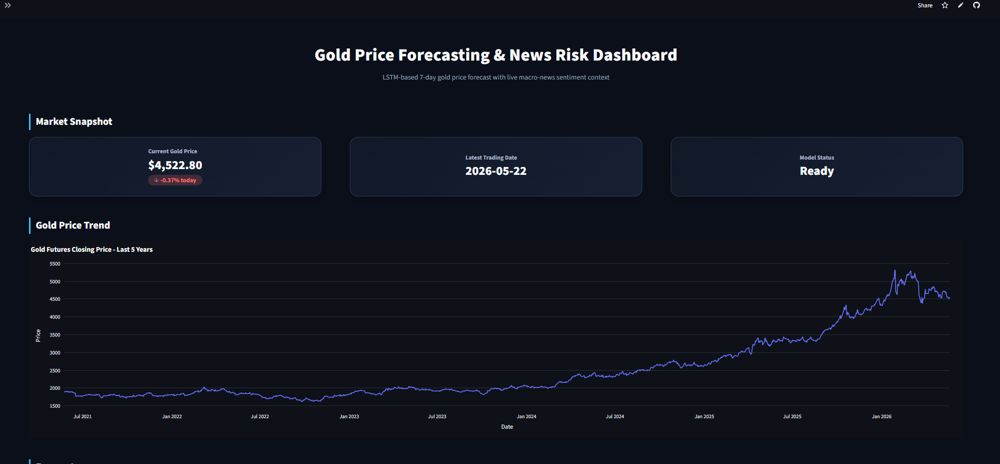
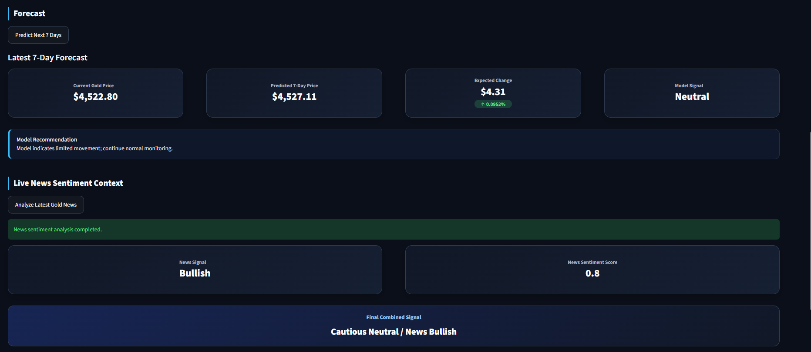
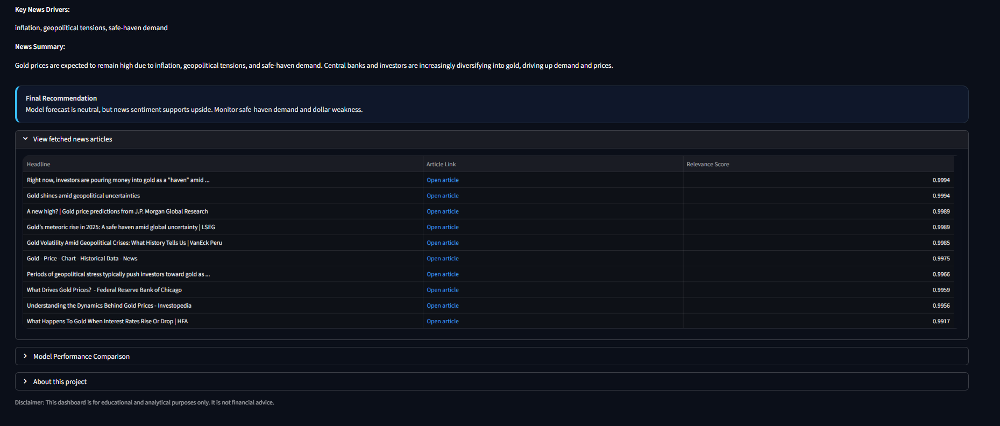

# Gold Price Forecasting & News Risk Dashboard

A machine learning, deep learning, and NLP-based dashboard for forecasting 7-day future gold prices and generating risk-aware market recommendations using live macro-financial news.

This project combines time-series forecasting, financial feature engineering, LSTM-based deep learning, live news retrieval, and LLM-powered sentiment analysis into an interactive Streamlit dashboard.

---

## Live Demo
```text
https://aashutoshgoldapp.streamlit.app/
```

---

## Dashboard Preview

### Market Snapshot and Gold Price Trend



### 7-Day Gold Price Forecast



### Live News Sentiment and Final Recommendation



---
## Project Overview

Gold prices are influenced by several market and macroeconomic factors, including historical price movement, volatility, momentum, inflation expectations, interest rates, dollar strength, safe-haven demand, and geopolitical uncertainty.

This project forecasts the 7-day future price of gold using a return-based LSTM model trained on historical gold futures data. The forecast is then combined with real-time macro-news sentiment analysis using Tavily and Groq to generate a more context-aware market signal.

The final dashboard provides:

- Current gold price
- Historical gold price trend
- 7-day future price prediction
- Expected price change
- Model-based risk signal
- Live news sentiment signal
- Final combined recommendation
- Model performance comparison

---

## Key Features

### Machine Learning and Deep Learning

- Built a complete time-series forecasting pipeline for gold futures prices.
- Engineered financial features including:
  - Daily returns
  - Moving averages
  - Rolling volatility
  - Momentum indicators
  - Volume-based features
- Trained a return-based LSTM model to predict 7-day future gold returns.
- Converted predicted returns into future gold price estimates.
- Compared the model against a naive persistence baseline.
- Selected the final model based on actual evaluation metrics rather than assumptions.

### NLP and Live News Analysis

- Integrated Tavily API to fetch latest gold and macroeconomic news.
- Used Groq LLM API to analyze live news headlines and summaries.
- Extracted structured market sentiment signals including:
  - Overall news signal
  - Gold sentiment score
  - Inflation risk
  - Interest rate risk
  - Dollar pressure
  - Safe-haven demand
  - Geopolitical risk
  - Market uncertainty
- Combined the LSTM forecast with NLP-based news sentiment to generate final risk-aware recommendations.

### Dashboard

- Built an interactive dashboard using Streamlit.
- Visualized historical gold price movement using Plotly.
- Added clickable live news article links.
- Deployed the app using Streamlit Community Cloud.
- API keys are accepted through the sidebar and are not hardcoded.

---

## Final Model

The final selected forecasting model is:

```text
Gold Market-Only Return-Based LSTM
```

The model predicts the 7-day future return of gold and then converts it into a future price estimate.

The market-only LSTM was selected because it outperformed the naive baseline and was more stable than external-feature and event-feature models.

---

## Model Performance

| Model | MAE | RMSE | MAPE | R2 |
|---|---:|---:|---:|---:|
| Naive Baseline | 167.19 | 217.40 | 3.75% | 0.786 |
| Gold Return-Based LSTM | 160.79 | 213.36 | 3.60% | 0.794 |

The LSTM model achieved a lower MAPE than the naive baseline, showing that it learned useful short-term patterns from historical gold price data.

---

## Potential Business Impact

Gold is a high-value commodity, and even small percentage movements can create significant procurement or trading impact for businesses dealing with large purchase volumes.

This dashboard can support decision-making by providing:

- Early indication of possible short-term price movement
- Risk-aware procurement timing
- Market sentiment context from live news
- Reduced dependence on manual news monitoring
- Better visibility into whether the model forecast and news sentiment agree or conflict

### Example Impact Calculation

If an organization plans to purchase gold worth ₹10 crore and the model-news system helps avoid even a 1% adverse price movement, the potential cost avoidance can be:

```text
Potential Cost Avoidance = Purchase Value × Avoided Price Movement

= ₹10,00,00,000 × 1%
= ₹10,00,000
```

This means that for a ₹10 crore gold exposure, even a 1% improvement in timing or risk awareness could potentially help avoid approximately ₹10 lakh in adverse price movement.

### Why This Matters

The model is not intended to directly execute financial decisions. Instead, it acts as a decision-support system by combining quantitative forecasting with qualitative market sentiment.

For high-value commodities like gold, this type of system can help analysts, procurement teams, and market-risk teams monitor short-term price risk more effectively.

---

## Experiments Performed

### 1. Market-Only LSTM

The first model used historical gold market data only.

Features included:

- Open price
- High price
- Low price
- Close price
- Volume
- Daily return
- Moving averages
- Rolling volatility
- Momentum
- Volume trends

This became the final selected model.

### 2. External Market Features

External indicators such as silver, crude oil, dollar index, S&P 500, and NASDAQ were also tested.

However, the external-feature LSTM showed signs of overfitting and performed worse than the simpler market-only model.

This showed that adding more features does not always improve model performance when the dataset size is limited.

### 3. Economic Events Experiment

A macroeconomic events dataset was also used to engineer event-based features such as:

- Event count
- Inflation event count
- Interest rate event count
- Employment event count
- Trade event count
- Country importance weights
- Event importance weights
- Normalized surprise values against consensus, forecast, and previous values

The Gold + Economic Events LSTM was tested but did not outperform the baseline. Therefore, these event features were not used in the final prediction model.

This experiment helped validate that the final model selection was based on performance rather than assumptions.

---

## NLP Layer

The NLP layer is used as a market explanation and risk-context system rather than as a direct training input to the LSTM.

The live news pipeline works as follows:

```text
Tavily Search
→ Latest gold and macroeconomic news
→ Groq LLM analysis
→ Structured sentiment scores
→ Combined model + news recommendation
```

The LLM returns structured JSON containing:

```json
{
  "overall_news_signal": "bullish / bearish / neutral / mixed",
  "gold_sentiment_score": "between -1 and 1",
  "inflation_risk_score": "between 0 and 1",
  "interest_rate_risk_score": "between 0 and 1",
  "dollar_pressure_score": "between -1 and 1",
  "safe_haven_demand_score": "between 0 and 1",
  "geopolitical_risk_score": "between 0 and 1",
  "market_uncertainty_score": "between 0 and 1",
  "key_drivers": ["driver 1", "driver 2", "driver 3"],
  "summary": "short market summary"
}
```

The final signal combines:

```text
LSTM Forecast Signal + Live News Sentiment Signal
```

Example:

```text
Model Signal: Neutral
News Signal: Bullish
Final Combined Signal: Cautious Neutral / News Bullish
```

---

## Tech Stack

| Category | Tools Used |
|---|---|
| Programming Language | Python |
| Data Source | Yahoo Finance through yfinance |
| Machine Learning | scikit-learn |
| Deep Learning | TensorFlow / Keras |
| NLP / LLM | Groq API |
| Live News Search | Tavily API |
| Dashboard | Streamlit |
| Visualization | Plotly |
| Model Persistence | joblib, Keras model saving |
| Deployment | Streamlit Community Cloud |
| Version Control | Git, GitHub |

---

## Project Structure

```text
commodity/
│
├── app.py
├── requirements.txt
├── README.md
├── .gitignore
│
├── models/
│   ├── gold_market_only_lstm.keras
│   ├── gold_feature_scaler.pkl
│   ├── gold_feature_columns.pkl
│   └── gold_time_steps.pkl
│
├── outputs/
│   ├── gold_model_comparison.csv
│   ├── gold_events_model_comparison.csv
│   ├── latest_gold_prediction_summary.json
│   ├── latest_gold_news_context.json
│   └── combined_gold_forecast_summary.json
│
├── data/
│   └── economic_calendar_19_24.csv
│
└── notebooks/
    ├── 01_gold_event_model.ipynb
    ├── 02_gold_lstm.ipynb
    └── 03_gold_news_nlp_context.ipynb
```

---

## How to Run Locally

### 1. Clone the Repository

```bash
git clone https://github.com/aashutosh4all/Gold-Forecasting-.git
cd Gold-Forecasting-
```

### 2. Install Dependencies

```bash
pip install -r requirements.txt
```

### 3. Run the Streamlit App

```bash
streamlit run app.py
```

On Windows, you can also use:

```bash
py -m streamlit run app.py
```

---

## API Keys

The app uses API keys only through the Streamlit sidebar.

You need:

- Tavily API key for live news fetching
- Groq API key for LLM-based sentiment analysis

No API keys are hardcoded in the project.

---

## Dashboard Workflow

```text
Page Load
→ Show current gold price
→ Show historical price trend
→ User clicks "Predict Next 7 Days"
→ LSTM generates forecast
→ User enters Tavily and Groq API keys
→ User clicks "Analyze Latest Gold News"
→ App fetches latest news
→ Groq analyzes market sentiment
→ Final combined recommendation is displayed
```

---

## Key Learning Outcomes

This project demonstrates:

- Time-series forecasting using deep learning
- Financial feature engineering
- Baseline model comparison
- Model selection based on actual performance
- Handling overfitting in feature-rich models
- NLP-based market sentiment extraction
- Combining quantitative model output with qualitative news context
- Streamlit dashboard development
- GitHub version control and cloud deployment

---

## Future Improvements

Possible future extensions include:

- Adding multi-horizon forecasts such as 1-day, 7-day, and 30-day predictions
- Using transformer-based time-series models
- Adding SHAP or feature importance analysis
- Creating an automated daily forecast pipeline
- Adding more robust financial news filtering
- Including additional macro indicators such as real yields, CPI, and Fed funds rate
- Storing daily predictions and news sentiment history in a database

---

## Disclaimer

This project is created for educational and analytical purposes only.

<<<<<<< HEAD
It is not financial advice. The predictions and recommendations generated by this dashboard should not be used as the sole basis for investment or trading decisions.
=======
It is not financial advice. The predictions and recommendations generated by this dashboard should not be used as the sole basis for investment or trading decisions.
>>>>>>> 708114b (Add dashboard screenshots to README)
